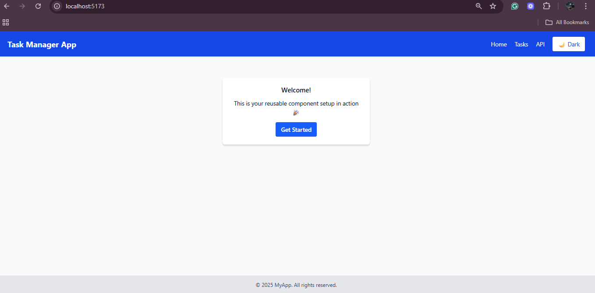
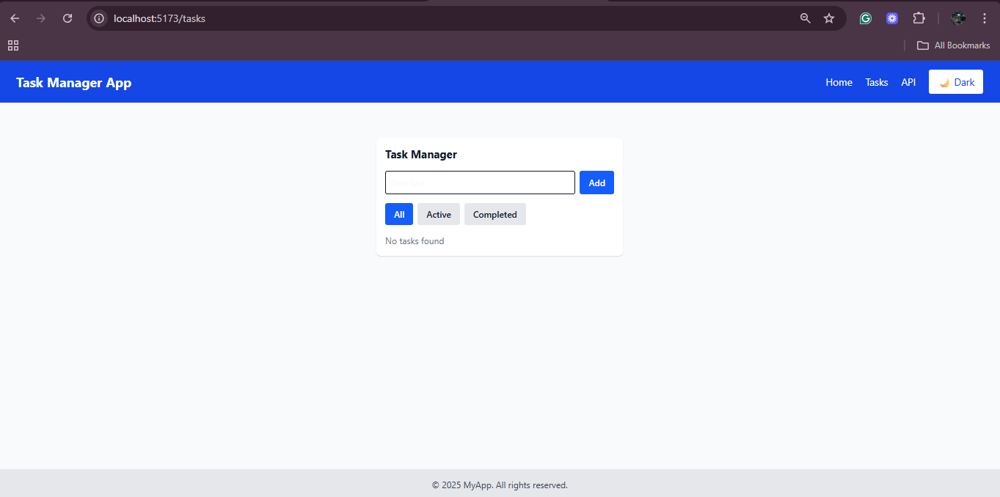
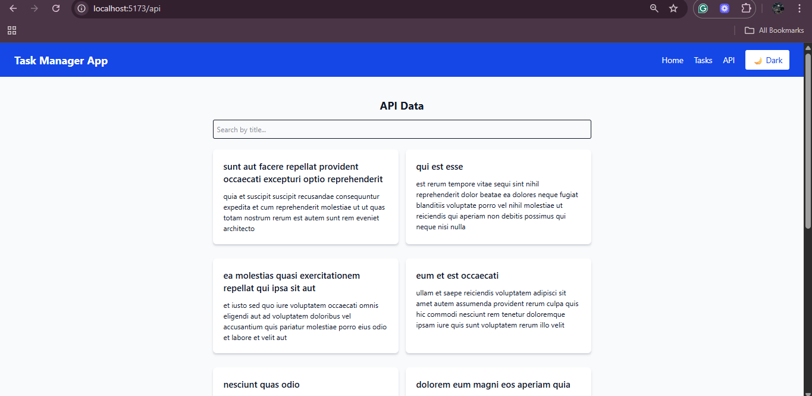
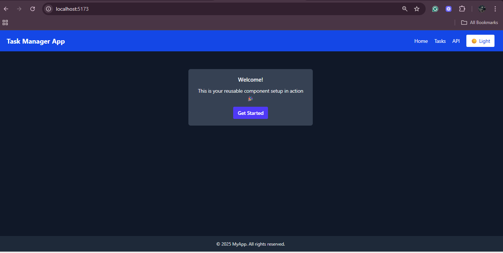

# React JS & JSX Mastering — Front-end Development Exercises

A learning repository containing front-end exercises and a Vite + React sample app that demonstrates React, JSX, CSS, Tailwind, and common component patterns.

Below you'll find a quick project overview, exact setup instructions (Windows PowerShell), project structure, usage scripts (from `my-react-app/package.json`), and screenshots.

## Screenshot preview

Below are simple illustrative screenshots (placeholders) included in the repo. Replace them with real screenshots by saving PNG/SVG images to `my-react-app/public/screenshots/`.

Screenshot — Home / Header



Screenshot — Task Manager card



Screenshot - Task Manager API



Screenshot - Dark Mode toggle




## Quick facts

- Project: `my-react-app` — Vite + React + Tailwind sample application
- Frameworks: React 19, Vite, Tailwind CSS
- Location: `my-react-app/`

## Prerequisites

- Node.js (v16+ recommended)
- npm (bundled with Node) — commands shown for PowerShell

## Setup (Windows PowerShell)

1. Open PowerShell and change to the app folder:

```powershell
cd "c:\Users\Immaculate Kimani\Desktop\react-js-jsx-and-css-mastering-front-end-development-KimaniImmaculate\my-react-app"
```

2. Install dependencies:

```powershell
npm install
```

3. Start the development server:

```powershell
npm run dev
```

Open the local URL printed by Vite (commonly http://localhost:5173).

## Scripts (from `my-react-app/package.json`)

The relevant npm scripts are:

- `npm run dev` — start Vite dev server with HMR
- `npm run build` — build production assets
- `npm run preview` — locally preview the production build
- `npm run lint` — run ESLint across the project

Use these commands from inside `my-react-app/`.

## Live demo / Deployment

Live demo: [Add your deployed URL here](https://example.com)


## Project structure

Below is a more detailed tree of the repository and the `my-react-app` application so you can quickly locate files.

Root (top-level)

```
README.md
README1.md
Week3-Assignment.md
my-react-app/
```

`my-react-app/` (important files and folders)

```
my-react-app/
├─ package.json
├─ vite.config.js
├─ index.html
├─ public/
│  ├─ screenshots/
│  │  ├─ TM1.png            # placeholder/real screenshots (replace as needed)
│  │  ├─ TM2.png
│  │  ├─ TM3.png
│  │  └─ DarkMode.png
│  └─ vite.svg
├─ src/
│  ├─ main.jsx
│  ├─ App.jsx
│  ├─ App.css
│  ├─ index.css
│  ├─ assets/              # images, icons, fonts
│  ├─ components/
│  │  ├─ APIPage.jsx
│  │  ├─ Button.jsx
│  │  ├─ Card.jsx
│  │  ├─ Footer.jsx
│  │  ├─ Layout.jsx
│  │  ├─ Navbar.jsx
│  │  └─ TaskManager.jsx
│  ├─ context/
│  │  └─ ThemeContext.jsx
│  └─ hooks/
│     └─ useLocalStorage.js
```

## Notes & tips

- The app uses Vite (fast dev server) and Tailwind for styling.
- If you change dependencies, run `npm install` again.
- Run `npm run lint` to catch ESLint warnings.

## Small contract (inputs / outputs / success criteria)

- Input: Node.js environment and the repository cloned locally.
- Output: Running dev server available at a local URL and a production build in `dist/` after `npm run build`.
- Success: `npm run dev` serves the app and pages load without runtime errors.

## Troubleshooting

- If `npm run dev` fails, check Node version (`node -v`) and delete `node_modules` + `package-lock.json` then `npm install`.
- If ESLint errors block you, run `npm run lint` to see details.

## Contributing

Contributions are welcome. For smaller improvements: fork, create a branch, commit, and open a PR with a brief description.


